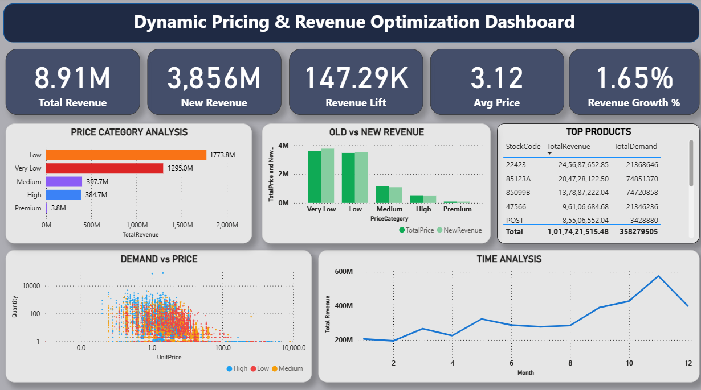

#  Dynamic Pricing & Revenue Optimization System

 **Live App:** https://priceopt.streamlit.app/  
 **Dashboard Preview:**  


---

##  Overview

This project is an end-to-end **Dynamic Pricing System** designed to optimize revenue using data-driven insights and demand analysis.

It combines **data analytics, machine learning, and interactive dashboards** to simulate real-world pricing strategies used by modern e-commerce companies.

---

##  Business Problem

Many businesses use **static pricing**, which leads to:

-  Revenue loss during high demand  
-  Low conversions during low demand  
-  No demand-based pricing strategy  
-  Poor decision-making without insights  

---

##  Solution

This system solves the problem by:

- ✔ Analyzing **price vs demand relationship**  
- ✔ Segmenting products into pricing categories  
- ✔ Building a **dynamic pricing model**  
- ✔ Simulating optimized pricing strategies  
- ✔ Visualizing insights via **Power BI & Streamlit dashboards**

---

##  Tech Stack

- **Python** – Data Processing & Modeling  
- **Pandas / NumPy** – Data Analysis  
- **Plotly** – Interactive Visualizations  
- **SQL** – Data Querying  
- **Power BI** – Business Dashboard  
- **Streamlit** – Web App Deployment  

---

##  Key Features

-  Demand vs Price Analysis  
-  Revenue Optimization Strategy  
-  Price Category Segmentation  
-  ML-based Pricing Insights  
-  Interactive Dashboard (Streamlit)  
-  Business KPI Tracking  

---

##  Key Insights

- Lower-priced products drive **higher demand volume**  
- Premium products contribute **higher per-unit revenue**  
- Dynamic pricing improves **overall revenue performance**  
- Seasonal trends significantly impact revenue  

---

##  Business Impact

-  Increased revenue using optimized pricing  
-  Better decision-making using data insights  
-  Real-time pricing simulation capability  
-  Improved product-level strategy  

---

##  Project Workflow

1. Data Cleaning & Preprocessing  
2. Feature Engineering (Time, Price, Demand)  
3. Exploratory Data Analysis  
4. Demand vs Price Modeling  
5. Revenue Optimization Logic  
6. Dashboard Development (Power BI + Streamlit)  

---

##  Run Locally

```bash
git clone https://github.com/your-username/dynamic-pricing-revenue-optimization-system.git
cd dynamic-pricing-revenue-optimization-system
pip install -r requirements.txt
streamlit run app.py
```
#  4. PROJECT STRUCTURE

Your folder should look like:

```
Dynamic-Pricing-Project/
│
├── app.py
├── final_dynamic_pricing_data.csv
├── README.md
├── requirements.txt

```
